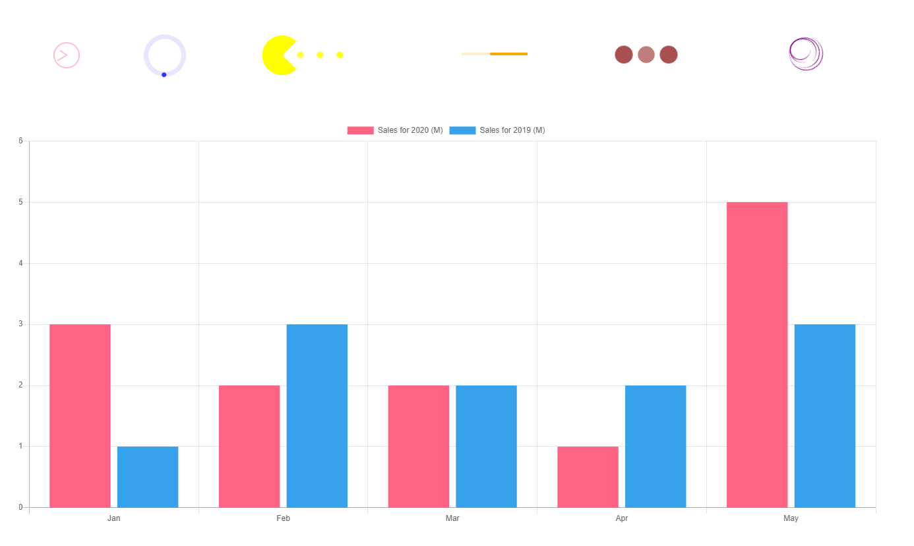

<h1 align="center">
  
</h1>

Este projeto apresenta diversas bibliotecas e suas implementações, tais como:

- Componentes para Gráficos
- Componente para seleção de cor (ChromePicker utilizado), mas você pode importar outros temas como o AlphaPicker, CirclePicker, CompactPicker, GithubPicker, MaterialPicker, PhotoshopPicker ou TwitterPicker.
- Contador com delay, disparo automático ou manual.
- Componente para apresentação de um cartão de crédito
- Componente de seleção de data com apresentação de calendário.
- Componentes para ícones
- Componentes para detectar tempo de atividade do usuário
- Componentes para apresentar caixa de diálogo
- Componente para reproduzir variedades de URLs e diretórios de arquivos.
- Componente indicador de carregamento de página/componente customizado
- Componentes para apresentar notificações

## Tecnologias utilizadas:

- [react-chartjs-2](https://www.npmjs.com/package/react-chartjs-2)
- [react-color](https://www.npmjs.com/package/react-color)
- [react-countup](https://www.npmjs.com/package/react-countup)
- [react-credit-cards](https://www.npmjs.com/package/react-credit-cards)
- [react-datepicker](https://www.npmjs.com/package/react-datepicker)
- [react-icons](https://www.npmjs.com/package/react-icons)
- [react-idle-timer](https://www.npmjs.com/package/react-idle-timer)
- [react-modal](https://www.npmjs.com/package/react-modal)
- [react-player](https://www.npmjs.com/package/react-player)
- [react-spinners](https://www.npmjs.com/package/react-spinners)
- [react-toastify](https://www.npmjs.com/package/react-toastify)
